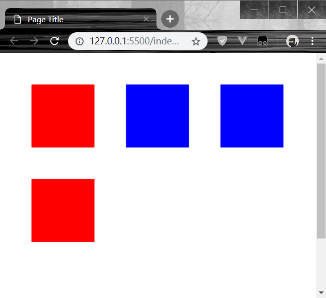

> 保存绘制状态
```
var canvas = $("#myCanvas");
var context = canvas.get(0).getContext("2d");

context.fillStyle = "rgb(255,0,0)";
context.save(); //保存画布状态
context.fillRect(0,0,50,50); //红色正方形
```

---
> 恢复绘图状态
```
context.fillStyle = "rgb(0,0,255)";
context.fillRect(50,50,100,100); //蓝色正方形
context.restore(); //恢复画布状态
context.fillRect(100,100,50,50); //红色正方形
```
* 通过调用restore方法，来恢复为之前save的状态
---
> 保存和恢复多个绘图状态
```
context.fillStyle = "rgb(255,0,0)";
context.save();
context.fillRect(50,50,100,100); //红色正方形

context.fillStyle = "rgb(0,0,255)";
context.save();
context.fillRect(200,50,100,100); //蓝色正方形

context.restore();
context.fillRect(350,50,100,100); //蓝色正方形

context.restore();
context.fillRect(500,50,100,100); //红色正方形
```
* 以上代码，画布存了两个绘图状态，先存了红色状态，再存了蓝色状态；
* 使用restore方法恢复时，首先取最近保存的状态，即蓝色状态；
* 红色状态保持等待调用状态；
* 再次使用restore方法时，调取红色状态；
  