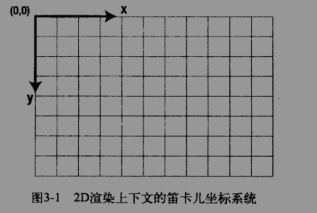
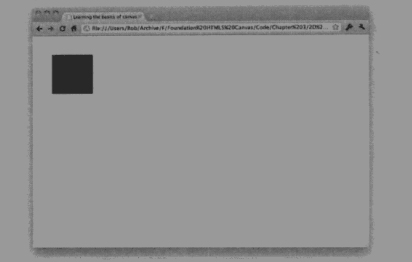

* > canvas初始化
    ``` 标签
    <canvas id="myCanvas" width="300" height="150">您的浏览器暂不支持canvas功能</canvas>
    ```
    * 未设置宽高时默认为 300 * 150
    * 兼容IE9+
    * 2D渲染坐标
    
---
* > js初始化
    ``` js初始化
    var canvas = $("#myCanvas");
    var context  = canvas.get(0).getContext('2d');
    context.fillRect(40,40,100,100);
    ```
    * 引用JQ时，需要用到get方法来访问Dom中的canvas元素
    * context.fillRect(x,y,width,height);x,y为正方形原点值
    * 运行后效果
    

