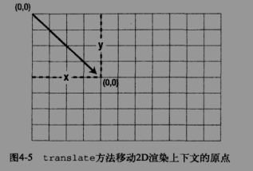
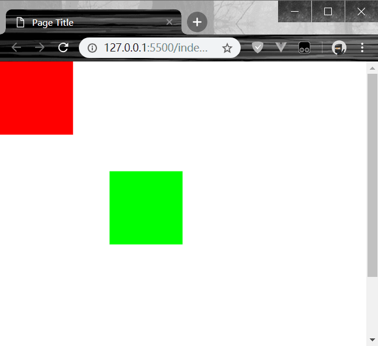

> 每一种变形方法，都会影响方法执行后所绘制的所有元素
>> canvas 变形------平移
```
context.fillRect(0,0,100,100);
context.translate(150,150);

context.fillStyle = "rgb(0,255,0)";
context.fillRect(0,0,100,100);
```
* translate(x,y); x,y为位移终点坐标
  
* 由于执行了一次平移，第二次绘制的绿色正方形原点坐标将为(150,150);
  
* 如果希望绿色正方形坐标原点仍为(0,0);可将参数设置为(-150,-150,100,100);
