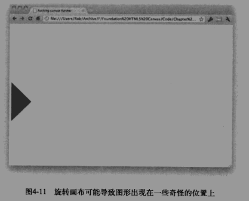
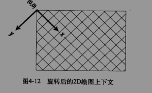

> canvas 变形------旋转
```
context.rotate(0.7854); //旋转45度(Math.PI/4)
context.fillRect(150,150,100,100);
```

* 旋转45度后，结果和我们期望的不一样，正方形旋转到了边界之外，因为rotate方法是围绕原点(0,0)来进行旋转的，正方形本身是不会旋转的
  
>> 对当前正方形进行旋转
 ###### 只旋转正方形时，应先将旋转原点通过平移，移动到正方形原点，在运行旋转方法
```
context.translate(200,200); //平移到正方形中心
context.rotate(0.7854); //旋转45度(Math.PI/4)
context.fillRect(-50,-50,100,100); //以旋转点为中心绘制一个正方形
```