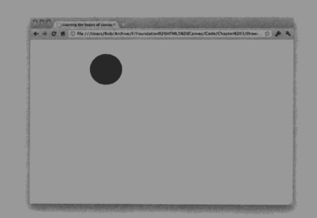

> 圆的绘制
* canvas并没有直接绘制圆的方法，通过绘制圆弧来实现
* context.beginPath(); //开始路径
* context.arc(230,90,50,0,Math.PI*2,false); //绘制一个圆形
* context.closePath(); //结束路径
* context.fill(); //填充路径
  
>>context.arc(x,y,radius,startAngle,endAngle,anticlockwise)
x,y(圆心坐标点),radius(半径),startAngle,endAngle(开始及结束的角度),anticlockwise(顺时针还是逆时针,false为顺时针，true为逆时针)