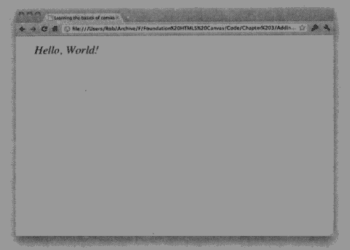
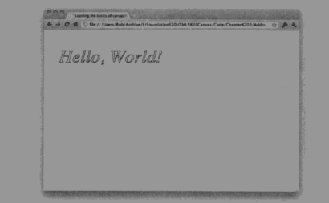

> 文本绘制
``` 文本绘制
var text = "Hello World!";
context.fillText(text,x,y);
```
* 尽量不要在canvas中创建文本，最好使用html来创建
* 接受四个参数，第四个参数为可选参数（文本内容,xy为文本左下角坐标值）
* canvas默认文本设置为10px sans-serif
---
``` 文本样式修改
context.font = "italic 30px serif" //修改字体样式、字号和字体
```

> 描边字体绘制
``` 字体绘制
var text = "Hello World";
context.font = "italic 30px serif";
context.strokeText(text,40,100);
```
