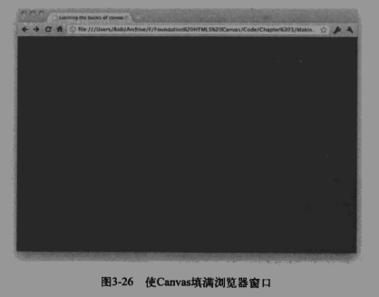

### 绘制方法
 * fillRect 绘制一个矩形并给它填充颜色
 * strokeRect 绘制一个矩形并给他绘制边框
 * arc 绘制一个圆形
 * fillText 绘制文本
 * save 保存绘制状态
---
### 样式方法
 * 【设置填充颜色】context.fillStyle = "rgb(255,0,0)"; 参数可为rgb()、red、#ff0000 
 * 【设置描边颜色】context.strokeStyle = "rgb(255,0,0)";
 * 【设置描边粗细】context.lineWidth = 5;
---
### canvas清除
* context.clearRect(x,y,width,height);
* 修改画布的width和height也会清空画布的所有内容及样式设置
---
### canvas全屏设置
* css
  ```
  * {
      margin:0px;
      padding:0px;
  }
  html,body{
      width:100%;
      height:100%;
  }
  canvas{
      display:block;
  }
  ```
* js
  ```
    canvas.attr("width",$(window).get(0).innerWidth);
    canvas.attr("height",$(window).get(0).innerHeight);
    context.fillRect(0,0,canvas.width(),canvas.height());
  ```
* 改变窗口自适应宽高
  ```
    $(window).resize(resizeCanvas);
    function resizeCanvas(){
        canvas.attr("width",$(window).get(0).innerWidth);
        canvas.attr("height",$(window).get(0).innerHeight);
        context.fillRect(0,0,canvas.width(),canvas.height());
    }
  ```
 